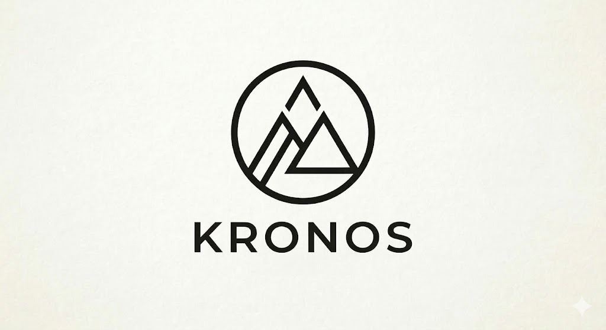

# Team Members:  
SDK (Obfuscated) (sbhask20@asu.edu)   
Katie Frazier (cefrazie@asu.edu),   
Mark Georgy (mngeorgy@asu.edu),   
Moosa Qureshi (maqures4@asu.edu),   
Jose Sandoval Islava (jsando66@asu.edu  

 

# kronos.ai

## 1. Problem Statement
**kronos.ai** is designed for adults who want to manage work, personal, and social commitments more efficiently. Today, scheduling information is spread across emails, text messages, chat apps, and paper reminders. Because these details are scattered, users must manually enter events into their calendars, which is time-consuming and increases the risk of missed appointments or scheduling conflicts.

## 2. Why Now?
This problem will become even more important in the next 3-5 years as people rely on more communication platforms for scheduling. At the same time, recent advances in AI make this solution possible now. Vision and OCR systems can read screenshots and photos, while language models can interpret unstructured text and convert it into organized calendar details. As AI becomes more common in productivity tools, users will increasingly expect automation for repetitive tasks like calendar management.

## 3. Proposed AI-Powered Solution
**kronos.ai** is an AI scheduling assistant that allows users to upload a screenshot or photo containing scheduling information. The system extracts the event title, date, time, and location, then returns a structured calendar entry. For example, a user could upload a text conversation planning dinner or a photo of a dentist appointment card. AI adds value because scheduling details often appear in informal or inconsistent formats that rule-based systems cannot handle well.

## 4. Initial Technical Concept
The system would use screenshots, emails, text conversations, and scanned reminders as input data. Key fields include the event title, date, time, location, and relevant notes. A vision or OCR model would read the content, a classifier would determine whether it contains calendar-related information, and a GPT-style model would convert it into a structured event. Access to the user’s calendar could also help identify scheduling conflicts. Our nanoGPT work could support structured event generation and evaluation.

## 5. Scope for MVP
In about six weeks, the MVP for **kronos.ai** could focus on one core feature: a user uploads a screenshot of a text conversation planning an event, and the system returns the event title, date, time, and location. This keeps the project realistic while still demonstrating its main value.

## 6. Risks and Open Questions
The main risks are accuracy, input ambiguity, and user interface design. Incorrectly extracted dates or times could create problems for users, and informal messages may be difficult to interpret. The team must also decide how users will review and confirm events before adding them to a calendar.

## 7. Planned Data Sources
Potential data sources include public OCR datasets, synthetic examples created by the team, sample screenshots of scheduling conversations, and calendar APIs. At minimum, the project requires reliable word recognition and event extraction data.
